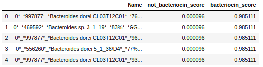

# (THIS CLASSIFIER HAS BEEN UPDATED. PLEASE GO TO https://github.com/lassebuurrasmussen/bacteriocin_classifier_v2.0 TO FIND A CLEANER IMPLEMENTATION).

## Welcome
This repository is a copy of *some* of the source code I used for my Master's Thesis.

#### You can find my paper [here](paper/thesis.pdf).

#### To run my classifier
You will need to install a few dependencies. In the example below I create a new conda environment with these installed:
```
conda create -yn new_env
conda install -yn new_env allennlp -c pytorch -c allennlp -c conda-forge
conda install -yn new_env tensorflow pandas Biopython gensim seaborn
conda activate new_env
```
The last line activates the newly installed environment.\
You will of course also need to download this repository:\
`git clone https://github.com/lassebuurrasmussen/bacteriocin_classifier`\
`cd bacteriocin_classifier`

Go grap the ELMo model that I used for this experiment at my [Google Drive](https://drive.google.com/open?id=1VaA92XizlP88AjJTPr7BJ2Nh_q2qmi5s), unzip and place the `options.json` and `weights.hdf5` files in `data/elmo_model_uniref50/`. Lastly, download the [classifier weights](https://drive.google.com/open?id=1UaFuCirtm289Y6Q7dbKCxpPI1AEtix8g), unzip and place the files in `code_modules/nn_training/BAC_UNI_len2006/final_elmo_CNNPAR_BAC_UNI_len2006`

Now, to run the model on the fasta in file the [sample_fasta.faa](sample_fasta.faa) and put results in `results.csv` you can do:\
`python run_model.py sample_fasta.faa results.csv`

And the output will be of the form:\


If you want to play around with everything else in the repository I've exported my environment to [conda_environment.yml](conda_environment.yml)

Enjoy!
